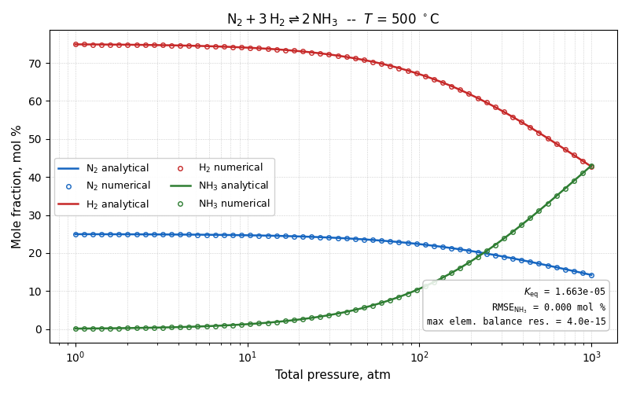
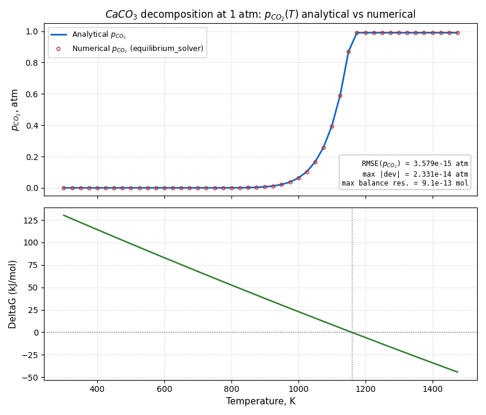
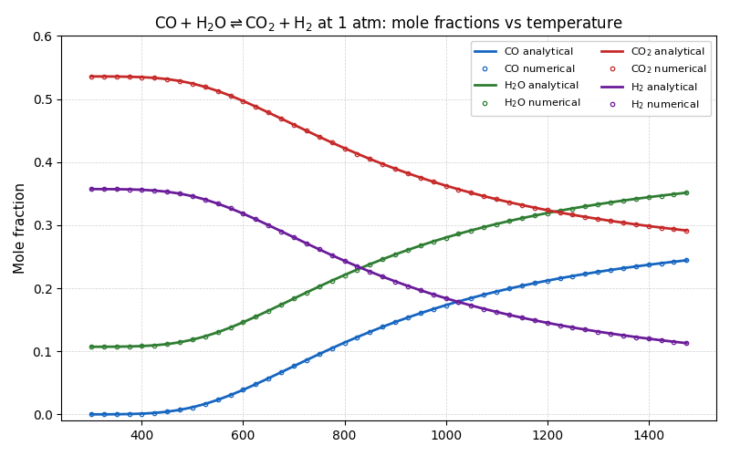
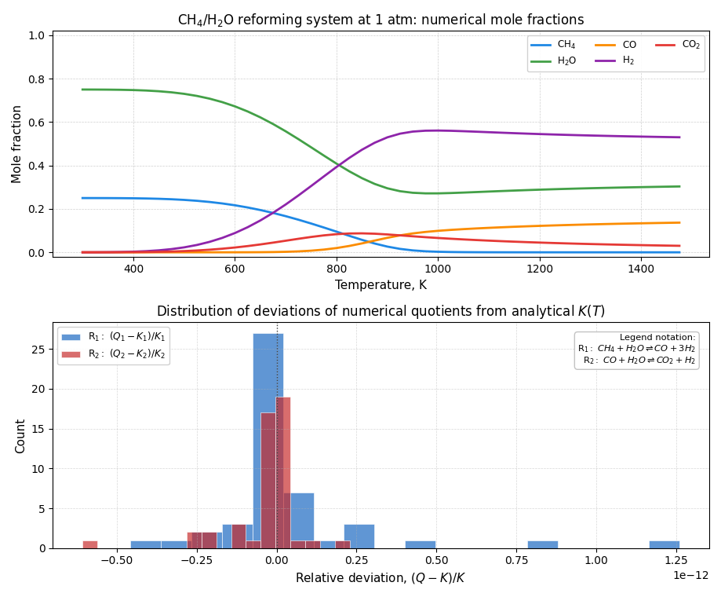

# Equilibrium Solver Usage and Validation Examples

This document presents practical examples of input preparation, equilibrium calculation, and post-processing with `equilibrium_solver`.
It also summarizes validation results obtained under multiple problem formulations:

* homogeneous gas-phase reactions;
* heterogeneous reaction systems;
* temperature-dependent equilibrium behavior;
* pressure-dependent equilibrium behavior;
* stoichiometric feed compositions;
* non-stoichiometric feed compositions.

## Minimal Solver Call

In all examples, equilibrium is computed by a single function call:

```python
from equilibrium_solver import calculate_equilibrium

n_eq = calculate_equilibrium(
    S=S.tolist(),
    phases=phases,
    elements=elements.tolist(),
    GibbsEnergies=gibbs,
    T=float(T),
    Pa=float(P),
)
```

Accordingly, the user specifies only:

- the elemental composition matrix `S`;
- phase identifiers `phases`;
- total elemental amounts `elements`;
- standard Gibbs energies `GibbsEnergies`;
- temperature `T` and pressure `Pa`.

The package then computes the equilibrium composition that satisfies mass-balance constraints and the Gibbs energy minimum criterion.

## API Guide for `calculate_equilibrium`

Function signature:

```python
calculate_equilibrium(
        S: Sequence[Sequence[float]],
        phases: Sequence[int],
        elements: Sequence[float],
        GibbsEnergies: Sequence[float],
        T: float,
        Pa: float = 1.0,
) -> list[float]
```

### Definition of Input Parameters

- `S`: elemental composition matrix of shape `(n_elements, n_species)`.
    - Rows correspond to elements (for example C, H, O).
    - Columns correspond to species.
    - `S[e][i]` is the number of atoms of element `e` in species `i`.
    - The matrix must be non-empty and rectangular.

- `phases`: sequence of integer phase identifiers of length `n_species`.
    - `phases[i]` is the phase index of species `i`.
    - Species assigned the same id belong to the same phase.
    - In the present formulation, the gas phase should be assigned id `0`; only for this phase are activities pressure-dependent under the specified system pressure.
    - Example:
        * `[0, 0, 0, 0]`: all four species are in the gas phase.
        * `[0, 0, 1, 2]`: the first two species are gaseous, while the other two belong to separate immiscible condensed phases.

- `elements`: vector of total elemental amounts of length `n_elements`.
    - This is the right-hand side of elemental balances.
    - Values must be finite and non-negative.
    - It is typically computed as `elements = S @ n0`, where `n0` is the initial species amount vector in moles.

- `GibbsEnergies`: vector of standard Gibbs energies of length `n_species`.
    - The order must exactly match the species column order in `S`.
    - Values must be finite.
    - For physical consistency, use thermodynamic data evaluated at the specified temperature (J/mol).

- `T`: temperature in K.
    - Must be finite and strictly positive.

- `Pa`: system pressure in atm (default `1.0`).
    - Must be finite and strictly positive.

### Dimension and Consistency Requirements

The function validates inputs and enforces:

- `len(phases) == n_species`;
- `len(GibbsEnergies) == n_species`;
- `len(elements) == n_elements`.

If these requirements are violated, or if invalid numeric values are provided, the solver raises an exception (`ValueError` or `RuntimeError`).

### Practical Workflow for Preparing Inputs

1. Define a species ordering and keep it consistent throughout the model.
2. Build matrix `S` according to this ordering (rows: elements, columns: species).
3. Assign phase ids in `phases`.
4. Define initial species amounts `n0` and compute `elements = S @ n0`.
5. Prepare `GibbsEnergies` for the same species order at the selected temperature `T`.
6. Call `calculate_equilibrium(...)`.

Minimal preparation template:

```python
import numpy as np
from equilibrium_solver import calculate_equilibrium

# Example species order: [A, B2, AB]
S = np.array([
        [1.0, 0.0, 1.0],  # element A
        [0.0, 2.0, 1.0],  # element B
])

phases = [0, 0, 1]
n0 = np.array([1.0, 0.5, 0.0])
elements = S @ n0
gibbs = np.array([-10000.0, -9000.0, -12000.0])

n_eq = calculate_equilibrium(
        S=S.tolist(),
        phases=phases,
        elements=elements.tolist(),
        GibbsEnergies=gibbs,
        T=1000.0,
        Pa=1.0,
)
```

### Output Interpretation

The function returns `list[float]` of length `n_species`:

- `n_eq[i]` is the equilibrium amount (mol) of species `i`;
- output ordering is identical to the species column ordering in `S`;
- values are non-negative up to numerical tolerance;
- elemental balances should hold: `S @ n_eq \approx elements`.

Recommended post-processing:

- mole fractions: `y_i = n_i / sum(n)`;
- for plotting, report `y_i` or mol %;
- for validation, monitor the maximum balance residual:
    `max(abs(S @ n_eq - elements))`;
- for reaction-level validation, compare reaction quotients `Q` (computed from `n_eq`) against analytical equilibrium constants `K(T)`.

Hence, the solver output is a thermodynamically consistent composition vector from which all engineering observables can be derived (mole fractions, conversion degrees, partial pressures, and reaction quotients).

## How to Run the Examples

Each example is implemented as a standalone script and can be executed by a single command:

```powershell
python ammonia.py
python calcium_carbonate.py
python water_shift.py
python reforming.py
```

The scripts print a numerical summary and generate figures for direct comparison between numerical and analytical results.

## 1. Ammonia Synthesis

Reaction:

$$
\mathrm{N_2 + 3H_2 \rightleftharpoons 2NH_3}
$$

Calculation conditions:

- $T = 500^\circ C$;
- pressure range: 1-1000 atm;
- feed: 1 mol `N2` + 3 mol `H2`.

For this case, the script compares the numerical solution with an exact analytical equilibrium composition.
Maximum relative elemental-balance residual: `4.00e-15`.

The figure shows that numerical markers coincide with analytical curves: increasing pressure shifts equilibrium toward ammonia, and the solver reproduces this behavior at machine-precision level.



## 2. Calcium Carbonate Decomposition

Reaction:

$$
\mathrm{CaCO_3(s) \rightleftharpoons CaO(s) + CO_2(g)}
$$

Calculation conditions:

- pressure: `1 atm`;
- temperature grid: `300-1475 K`.

Analytical validation is based on heterogeneous equilibrium theory: for pure condensed phases, the equilibrium partial pressure of `CO2` is given by $p_{CO_2,eq}(T) = K_p(T)$ until limited by total pressure and finite inventory constraints.
The root-mean-square deviation of $p_{CO_2}$ is at the level of `1e-15`.

In the upper panel, numerical and analytical $p_{CO_2}$ values are indistinguishable. The lower panel indicates the temperature at which reaction $\Delta G$ crosses zero, corresponding to thermodynamically favorable decomposition.



## 3. Water-Gas Shift Reaction

Reaction:

$$
\mathrm{CO + H_2O \rightleftharpoons CO_2 + H_2}
$$

Calculation conditions:

- pressure: `1 atm`;
- temperature grid: `300-1475 K`.

For this system, an analytical solution in terms of reaction extent is available. The script reconstructs analytical mole fractions independently and compares them to the `equilibrium_solver` result.
Maximum numerical deviation from the analytical solution is at the level of `1e-15`.

Analytical lines and numerical markers coincide over the full temperature grid.



## 4. Steam Reforming of Methane + Water-Gas Shift

Two coupled reactions are considered:

$$
\mathrm{CH_4 + H_2O \rightleftharpoons CO + 3H_2}
$$

$$
\mathrm{CO + H_2O \rightleftharpoons CO_2 + H_2}
$$

Calculation conditions:

- pressure: `1 atm`;
- temperature grid: `300-1475 K`;
- feed composition: `1 mol CH4 + 3 mol H2O`.

Validation is performed by comparing reaction quotients $Q_1$ and $Q_2$ (computed from the numerical composition) with thermodynamic equilibrium constants $K_1(T)$ and $K_2(T)$.

Key results:

- maximum elemental-balance residual: `6.21e-12 mol`;
- for the reforming reaction, `max |(Q-K)/K| = 1.261e-12`;
- for the water-gas shift reaction, `max |(Q-K)/K| = 6.071e-13`;
- mean deviations remain near zero, while distribution width remains at machine-precision scale.

This case is important because it validates multi-reaction, multicomponent equilibrium in a coupled formulation. Numerical deviations remain at machine-precision level, confirming solver correctness for more complex systems.



## Conclusion

The validation campaign demonstrates high numerical accuracy and robustness of the solver:

- agreement with analytical solutions and thermodynamic identities is observed at the `1e-15` to `1e-12` level;
- elemental balances are satisfied with small residuals;
- the computational framework remains stable across wide parameter ranges;
- the unified formulation supports efficient use in both regression validation and practical engineering equilibrium calculations.

Overall, the validation results confirm that the solver delivers accuracy, reproducibility, and computational efficiency in equilibrium composition prediction.